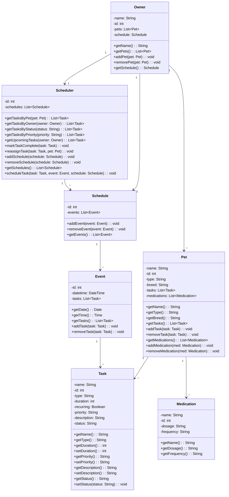

# PawPal Pet Care App - UML Diagram

## Relationships

- **Owner has Pets**: One owner can own multiple pets (1-to-many)
- **Pet has Tasks**: One pet can have multiple tasks (1-to-many)
- **Pet takes Medications**: One pet can take multiple medications (1-to-many)
- **Owner maintains Schedule**: One owner has one schedule (1-to-1)
- **Owner uses Scheduler**: One owner has one scheduler (1-to-1) that retrieves, organizes, and manages tasks across all pets
- **Scheduler manages Schedules**: One scheduler manages multiple schedules (1-to-many), adjusting and organizing them across all pets
